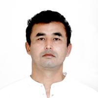

# Akram Rakhmanov



## About Me
I am very interested in programming, highly motivated in gaining new knowledge and use it in my work. I like to participate actively in team work.

## Skills
- HTML
- CSS
- JavaScript (Basic)
- Git

## Code Example
```
<li>
     
</li>      
```

## Education 
- University: Navoi State Pedagogical Institute, English major
- Course: Jyldyz Academy, Front-end Developer

## Languages
- Russian - fluent
- English - advanced
- Uzbek - fluent

## Contacts
- Location: Moscow, Russia
- Phone: +7 920 749 39 55
- Email: akram.rakhmanov.ph@gmail.com
- GitHub: [akramalfa] (https://github.com/)


